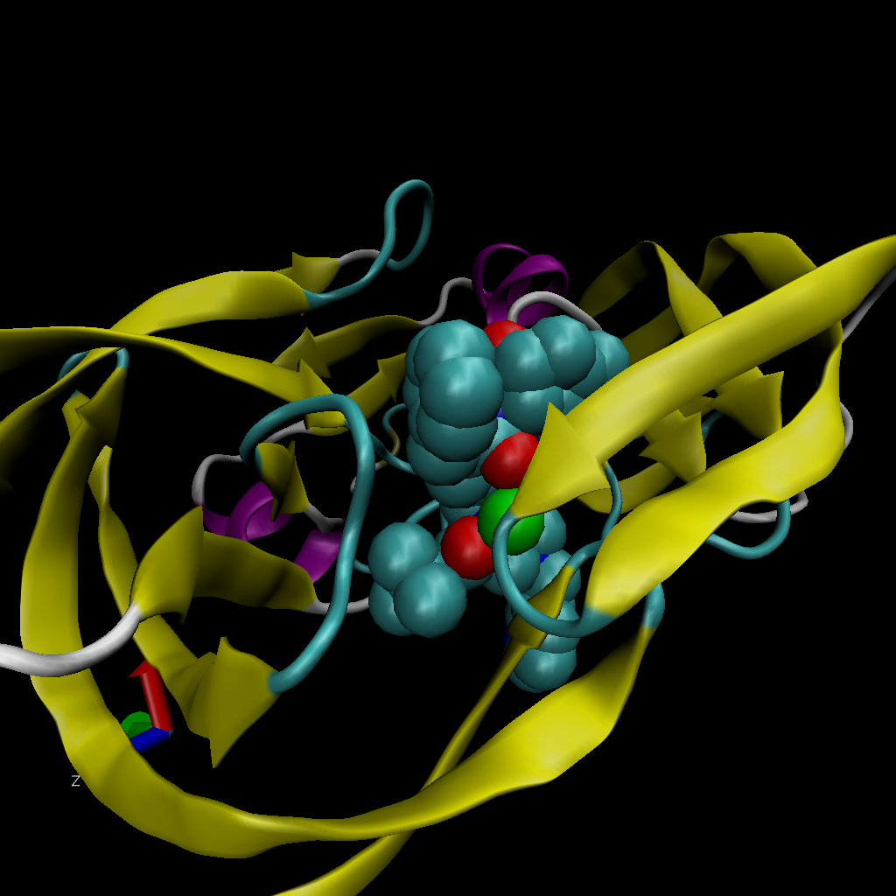

```{r}
db <- read.csv("Data Export Summary.csv", row.names=1)
head(db)
```


```{r}
method.sums<- colSums(db)
method.sums

```
#Q1.87.55% by X-ray and 4.92% by EM
```{r}
round((method.sums/method.sums["Total"])*100,2)

```

```{r}
type.sums <- rowSums(db) 
round((type.sums/method.sums["Total"])*100,2)
```


```{r}
round((db$Total/method.sums["Total"])*100,2)
```
```{r}
87.36+5.14+5.31
```
#Q2: 87.36% of structures are protein only, 97.81% of structures contain proteins.

#Q3:1828 structures



#Q4: the hydrogen atoms are very small, and since no hydrogen atoms are shown, each water molecule will only show 1 atom which is the oxygen.

#Q5:the water molecule in MK1 ligand binding site is HOH308:0

#Q6: it is the alpha helix with loops on both of its ends


