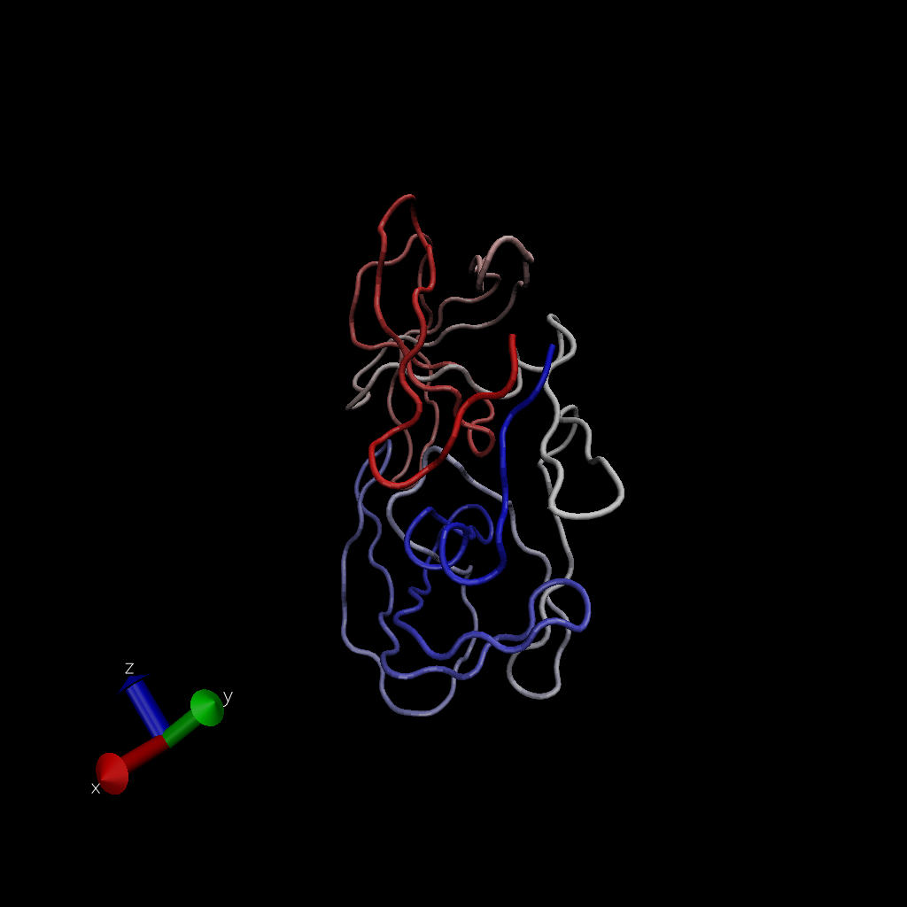
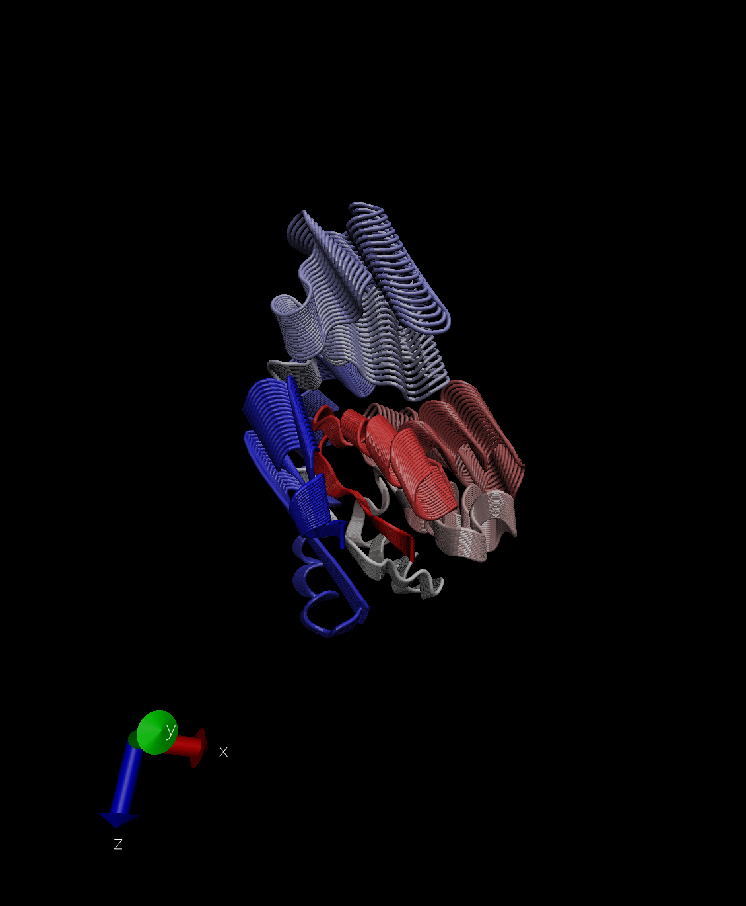

#Comparative Analysis of protein structures using the bio3d

```{r}
library(bio3d)

pdb <- read.pdb("1hel")
pdb
```

Normal Mode Analysis to predict the dynamics (flexibility) of the enzyme.

```{r}
modes <- nma(pdb)
plot(modes)
```

Make a "move" of its prediction motion. call this "trajectory"

```{r}
mktrj(modes, file="nma.pdb")
```



#Analysis of ADK

```{r}
aa <- get.seq("1ake_A")
```

```{r}
blast <- blast.pdb(aa)
```

```{r}
plot(blast)
```

```{r}
hits<-plot(blast)
```

```{r}
hits$pdb.id
```

```{r}
hits <- NULL
hits$pdb.id <- c('1AKE_A','4X8M_A','6S36_A','6RZE_A','4X8H_A','3HPR_A','1E4V_A','5EJE_A','1E4Y_A','3X2S_A','6HAP_A','6HAM_A','4K46_A','4NP6_A','3GMT_A','4PZL_A')
```

```{r}
files <- get.pdb(hits$pdb.id, path="pdb",splot="T", gzip="T")
```

```{r}
pdbs <- pdbaln(files, fit=T)
```

```{r}
pdbs <- pdbaln(files, fit = TRUE)#, exefile="msa")
```

```{r}
ids <- basename.pdb(pdbs$id)
plot(pdbs, labels=ids)
```

#PCA

```{r}
pc.xray <- pca(pdbs)
plot(pc.xray)
```

Make a trajectory visualization of the motion captured by the PC1

```{r}
pc1 <- mktrj(pc.xray,pc=1,file="pc_1.pdb")
```


