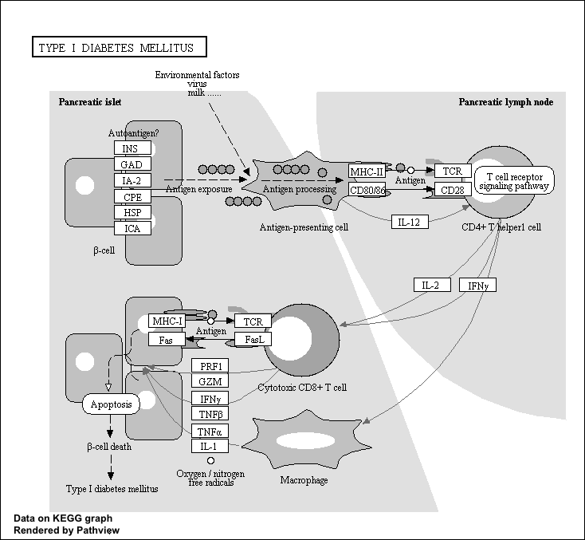

```{r}
counts <- read.csv("airway_scaledcounts.csv", row.names=1)
metadata <-  read.csv("airway_metadata.csv")
```

```{r}
head(counts)
```

```{r}
head(metadata)
```
#Q1: 38694 genes.
```{r}
nrow(counts)
```


#Q2: we have 4 cell lines.
```{r}
sum(metadata$dex == "control")
```

```{r}
control.inds <- metadata$dex == "control"
control.counts <- counts[, control.inds]
head(control.counts)
```


```{r}
control.means<- rowMeans(control.counts)
```

```{r}
treated.inds <- metadata$dex == "treated"
treated.counts <- counts[, treated.inds]
head(treated.counts)
treated.means<- rowMeans(treated.counts)
```

```{r}
control <- metadata[metadata[,"dex"]=="control",]
control.counts <- counts[ ,control$id]
control.mean <- rowSums( control.counts )/4
head(control.mean)
```

```{r}
library(dplyr)
control <- metadata %>% filter(dex=="control")
control.counts <- counts %>% select(control$id) 
control.mean <- rowSums(control.counts)/4
head(control.mean)
```

#Q3: replace "4" with "nrow(control)" to divide the rowSum with the correct number to calculate the mean if there is more samples

```{r}
control <- metadata[metadata[,"dex"]=="control",]
control.counts <- counts[ ,control$id]
control.mean <- rowSums( control.counts )/nrow(control)
head(control.mean)
```

#Q4: 
```{r}
treated <- metadata[metadata[,"dex"]=="treated",]
treated.counts <- counts[ ,treated$id]
treated.mean <- rowSums( treated.counts )/nrow(treated)
head(treated.mean)
```


```{r}
meancounts <- data.frame(control.means, treated.means)
```

#Q5:
```{r}
plot(meancounts)
```

#Q6: argument log
```{r}
plot(meancounts, log="xy")
```

#0 value for no change, "+" for increase, "-" are for decraese. work with log2(fold-change), and log2(fold-change) for meancounts df

```{r}
meancounts$log2fc <- log2(meancounts[,"treated.means"]/meancounts[,"control.means"])
head(meancounts)
```
```{r}
zero.vals <- which(meancounts[,1:2]==0, arr.ind=TRUE)
to.rm <- unique(zero.vals[,1])
mycounts <- meancounts[-to.rm,]
head(mycounts)
```

#Q7: arr.ind=T in which() will return the dimensional array indices of the zero counts genes. Taking the first column in the unique() function is to eliminate the duplicates, so that we can focus on the rows without counting any row twice when we type meancounts[-to.rm,]


#Q8:250

#Q9:367
```{r}
up.ind <- mycounts$log2fc > 2
down.ind <- mycounts$log2fc < (-2)
sum(up.ind)
sum(down.ind)
```

#Q10:No, because we need DESeq2 set a p-value to filter out the non-statistically significant fold changes. Thus, this outcome is not very precise since it is solely based on fold changes regardless if they are significant or not.

```{r}
head(meancounts[,1:2] ==0)
```

```{r}
zero.vals <- which(meancounts[,1:2] == 0, arr.ind =T)
head(zero.vals)
```

```{r}
to.rm<- unique(zero.vals[,"row"])
head(sort(to.rm))
```

```{r}
mycounts <- meancounts[-to.rm,]
head(mycounts)
```
```{r}
nrow(mycounts)
```


```{r}
sum(mycounts$log2fc)
```

```{r}
library(DESeq2)
citation("DESeq2")
```
fist set up input for Deseq

```{r}
dds <- DESeqDataSetFromMatrix(countData=counts, 
                              colData=metadata, 
                              design=~dex)
dds

```

```{r}
dds <- DESeq(dds)
```

```{r}
res <- results(dds)
res
```

```{r}
 summary(res)
```

```{r}
res05 <- results(dds, alpha=0.05)
summary(res05)
```

```{r}
library(AnnotationDbi)
library(org.Hs.eg.db)
```

```{r}
columns(org.Hs.eg.db)
```

```{r}
res$symbol <- mapIds(org.Hs.eg.db,
                     keys=row.names(res),
                     keytype="ENSEMBL",        
                     column="SYMBOL", 
                     multiVals="first")
head(res)
```

#Q11:

```{r}
res$entrez <- mapIds(org.Hs.eg.db,
                     keys=row.names(res),
                     column="ENTREZID",
                     keytype="ENSEMBL",
                     multiVals="first")


res$uniprot <- mapIds(org.Hs.eg.db,
                     keys=row.names(res),
                     column="UNIPROT",
                     keytype="ENSEMBL",
                     multiVals="first")

res$genename <- mapIds(org.Hs.eg.db,
                     keys=row.names(res),
                     column="GENENAME",
                     keytype="ENSEMBL",
                     multiVals="first")
head(res)
```


```{r}
ord <- order(res$padj)
head(res[ord,])
```


```{r}
write.csv(res[ord,], "deseq_results.csv")
```

write out whole results dataset ( including genes that don't change significantly).
```{r}
write.csv(res, file="allmyresults.csv")
```

```{r}
summary(res05)
```


volcano plot
```{r}
plot( res$log2FoldChange, -log(res$padj),ylab="-Log(P-value)", xlab="Log2(FoldChange)")
```
flip pvalue axis by putting a minus sign on it then we will have classic volcano plot.

```{r}
plot( res$log2FoldChange,  -log(res$padj), 
 ylab="-Log(P-value)", xlab="Log2(FoldChange)")
abline(v=c(-2,2), col="darkgray", lty=2)
abline(h=-log(0.05), col="darkgray", lty=2)
```

```{r}
# Setup our custom point color vector 
mycols <- rep("gray", nrow(res))
mycols[ abs(res$log2FoldChange) > 2 ]  <- "red" 

inds <- (res$padj < 0.01) & (abs(res$log2FoldChange) > 2 )
mycols[ inds ] <- "blue"

# Volcano plot with custom colors 
plot( res$log2FoldChange,  -log(res$padj), 
 col=mycols, ylab="-Log(P-value)", xlab="Log2(FoldChange)" )

# Cut-off lines
abline(v=c(-2,2), col="gray", lty=2)
abline(h=-log(0.1), col="gray", lty=2)
```

## add annotation data for our genes.
```{r}
columns(org.Hs.eg.db)
```

```{r}
library(EnhancedVolcano)
```

```{r}
x <- as.data.frame(res)

EnhancedVolcano(x,
    lab = x$symbol,
    x = 'log2FoldChange',
    y = 'pvalue')
```

```{r}
res$entrez <- mapIds(org.Hs.eg.db,
                     keys=row.names(res),
                     keytype="ENSEMBL",        
                     column="SYMBOL", 
                     multiVals="first")
```

the main **gage()** function requires a named vector of fold changes,


```{r}
library(pathview)
library(gage)
library(gageData)

data(kegg.sets.hs)
```

```{r}
foldchange <- res$log2FoldChange
names(foldchange) = res$entrez
```

```{r}
keggres = gage(foldchange, gsets = kegg.sets.hs)
```

```{r}
attributes(keggres)
```

```{r}
head(keggres$less, 3)
```

```{r}
pathview(gene.data=foldchange, pathway.id="hsa05310")
```

#Q12:
```{r}
pathview(gene.data=foldchange, pathway.id="hsa05332")
pathview(gene.data=foldchange, pathway.id="hsa04940")
```





```{r}
pathview(gene.data=foldchange, pathway.id="hsa05310", kegg.native=FALSE)
```

